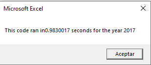
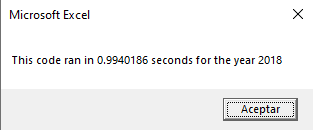

# Stock-analysis

## Overview of Project

The purpose of the project was to analyse the data set o some green energy stocks in the years 2017 and 2018 to determine the behavior of such within this period of time and therefore conclude wich stock is the most reliable to invest in.

As it is a considerably large amount of data that was given, instead of looking at the tables with the informtaion a *macro* was developed to make what it look like a tedious and time consuming task into something efficient and fast through the use of VBA.

## Results
### Stock performance 2017 and 2018

In 2017 the top 5 stocks that performed better and had the biggest return were **DQ** (199.4%), **SEDG** (184.5%), **ENPH**(129.5%), **FSLR**(101.3%) and **JKS**(53.9%), all the stocks that were evaluated had a positive return leaving aside **TERP** stocks that had a negative return, so any of those may seen as a good option to invest as seen in the image below.

On the other hand 2018 was a different story, looking at the same list of stocks only 2 of them had positive returns by the end of the year, **RUN** (84.0%) and **ENPH** (81.9%) wich makes these 2 as the most viable options to invest as seen on the image.

Overral looking at both years it seems that the berst option to invest in is ENPH as it had a positive return in both years, 129.5% in 2017 and 81.9% in 2018.

### Execution times

It may not seem as much but doing some simple tweeks into the original code makes the difference when it runs, the difference between the original (left images) and the refactored script (right images) show a difference in execution of just a few miliseconds, however when it comes to bigger data sets or a bigger code with more outputs, format, varaiables and so on will be even more significant its execution time.

***Execution times of original script (left) vs refactored script (right) from 2017 dataset***

***Execution times of original script (left) vs refactored script (right) from 2018 dataset***

As said before, by doing some simple tweeks to the code it is posiible to make it faster and more efficient, for example, by creating the arrays that we are going to use from the beggining and assigning them the proper data type depending on what we are working on, is posible to save some memory and also make its execution faster.

***Original code arrays and refactored code arrays***

## Summary

- What are the advantages or disadvantages of refactoring code?
 
A few of the advantages of refactoring code involves having better execution times, it also may help to find posible problems or bugs that the original code had and also to  make it easier to understand. If there is any disadvantages when refactoring code one of them may be that something ended up not working as intended which will lead to spending more time trying to fix it.

- How do these pros and cons apply to refactoring the original VBA script?

By refactoring the original code it was observable that it got better execution times and it became easier to understand, nevertheless some of the difficulties or cons encountered were that the code was not running as intended which made me look at the original code until I found why it was not running and it took quite some time to solve, at the end it was worth it to see the *refactoring* concept applied on this code.
